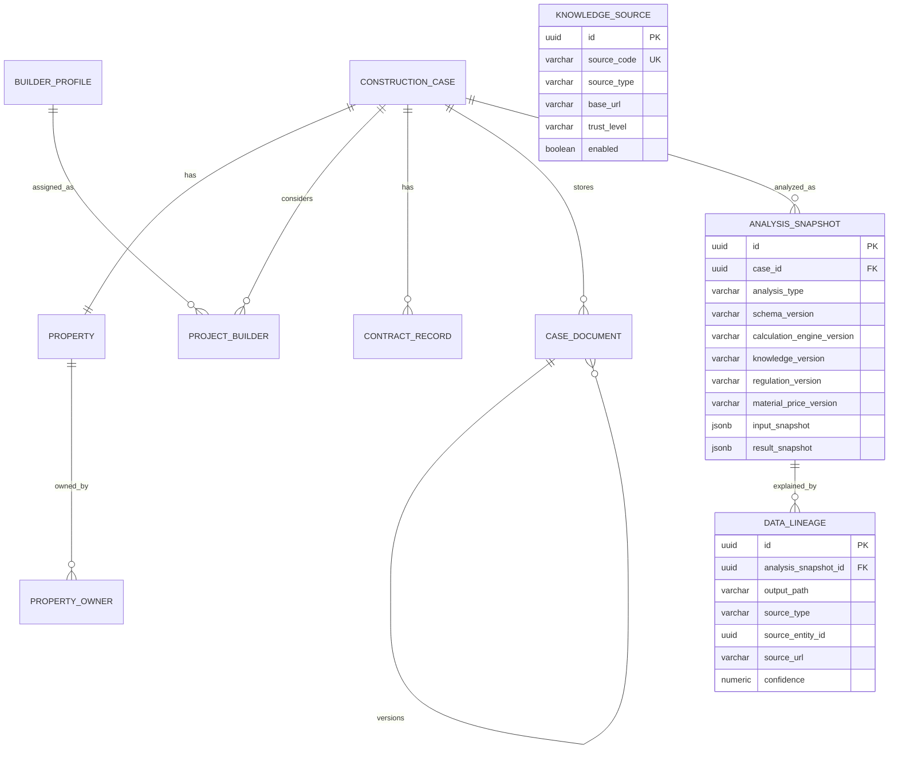

# Phase 5.1 ERD

```mermaid
erDiagram
    CONSTRUCTION_CASE ||--|| PROPERTY : has
    PROPERTY ||--o{ PROPERTY_OWNER : owned_by
    CONSTRUCTION_CASE ||--o{ PROJECT_BUILDER : considers
    BUILDER_PROFILE ||--o{ PROJECT_BUILDER : assigned_as
    CONSTRUCTION_CASE ||--o{ CONTRACT_RECORD : has
    CONSTRUCTION_CASE ||--o{ CASE_DOCUMENT : stores
    CASE_DOCUMENT ||--o{ CASE_DOCUMENT : versions
    CONSTRUCTION_CASE ||--o{ ANALYSIS_SNAPSHOT : analyzed_as
    ANALYSIS_SNAPSHOT ||--o{ DATA_LINEAGE : explained_by

    KNOWLEDGE_SOURCE {
        uuid id PK
        varchar source_code UK
        varchar source_type
        varchar base_url
        varchar trust_level
        boolean enabled
    }

    ANALYSIS_SNAPSHOT {
        uuid id PK
        uuid case_id FK
        varchar analysis_type
        varchar schema_version
        varchar calculation_engine_version
        varchar knowledge_version
        varchar regulation_version
        varchar material_price_version
        jsonb input_snapshot
        jsonb result_snapshot
    }

    DATA_LINEAGE {
        uuid id PK
        uuid analysis_snapshot_id FK
        varchar output_path
        varchar source_type
        uuid source_entity_id
        varchar source_url
        numeric confidence
    }
```